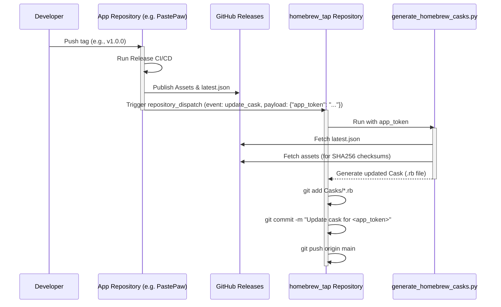

# Homebrew Tap Automation Pipeline

This document describes the automated pipeline for updating the Homebrew casks in this repository whenever a new release is published for any of the supported applications.

## Overview

The pipeline consists of two main parts:
1. **App Repositories (The Triggers):** When a new release is created in any of the application repositories (e.g., PastePaw, Netstat Cat, Notifier, HyperCapslock), a GitHub Actions workflow builds the assets, publishes the release, and then triggers a `repository_dispatch` event to this `homebrew_tap` repository.
2. **Homebrew Tap Repository (The Actor):** A GitHub Actions workflow in this repository (`update-casks.yml`) listens for the `repository_dispatch` event. Upon receiving it, it runs a Python script to fetch the latest release information, generates the updated Homebrew cask (`.rb` file), and automatically commits and pushes the changes back to this repository.

## Sequence Diagram

The following sequence diagram illustrates the interactions between the different nodes in the pipeline:

## Security

The communication between the App Repositories and this Tap Repository is secured using a GitHub Personal Access Token (PAT) named `HOMEBREW_TAP_PAT`. This token must have at least `repo` permissions and is stored as a repository secret in each of the app repositories. It is used to authenticate the `repository_dispatch` API call.
